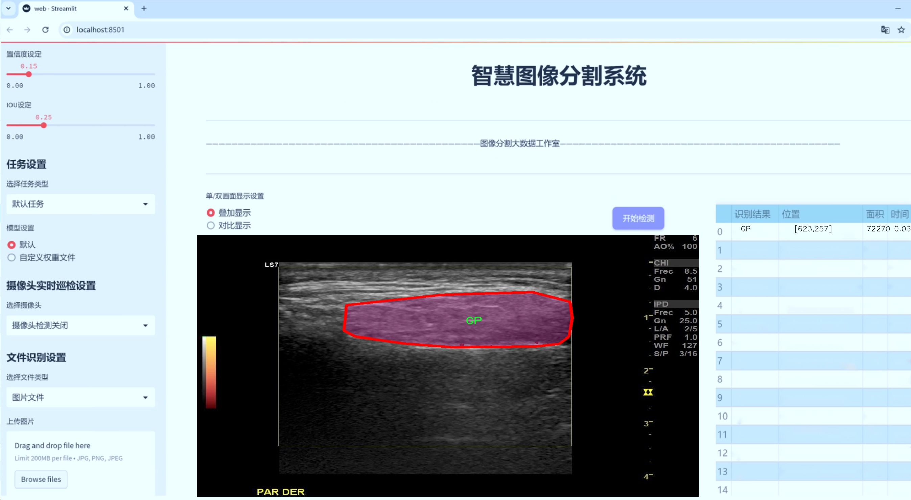
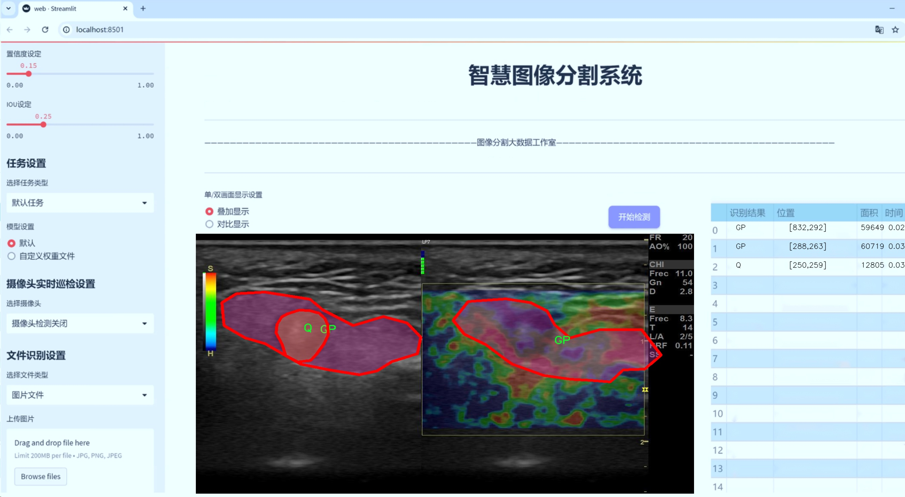
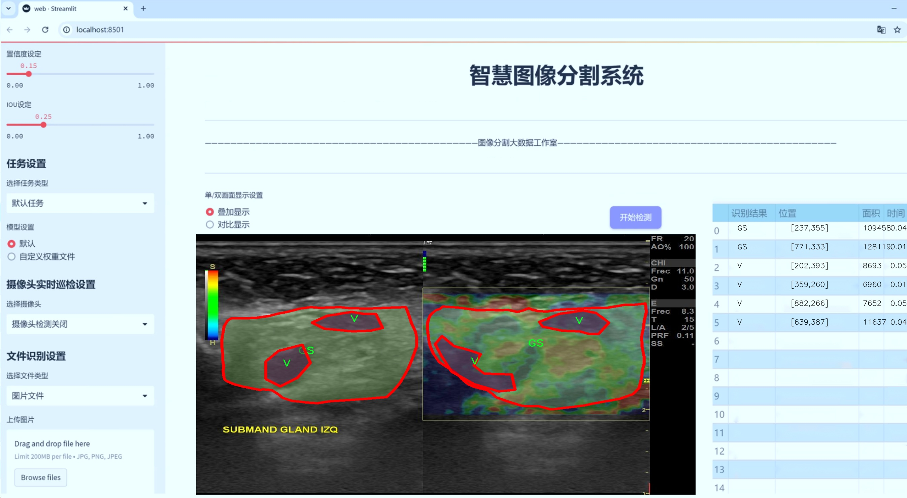
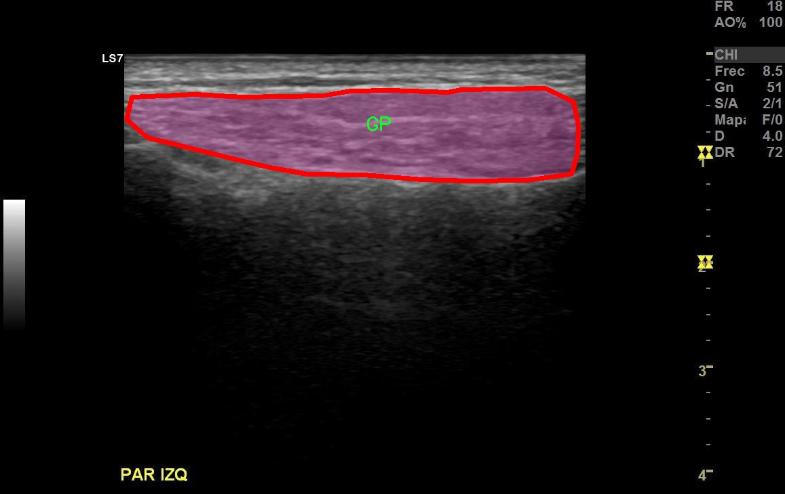
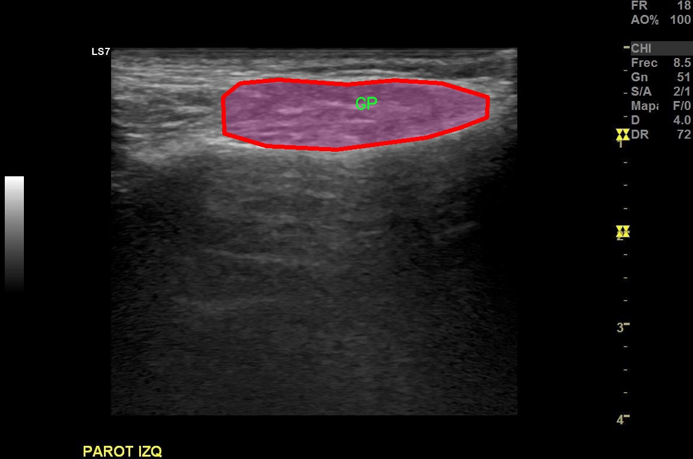
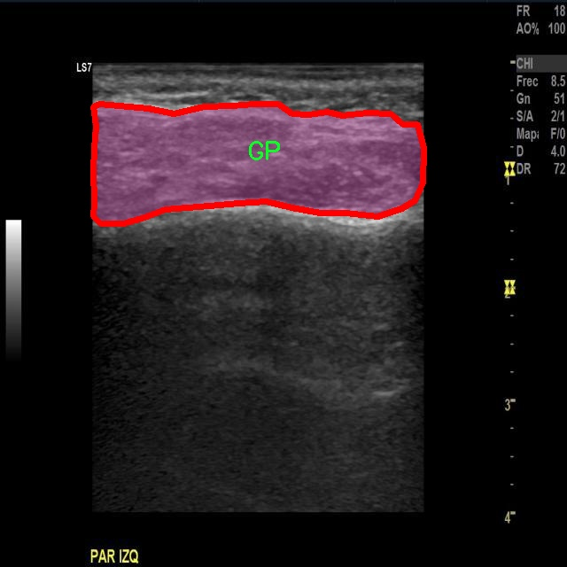
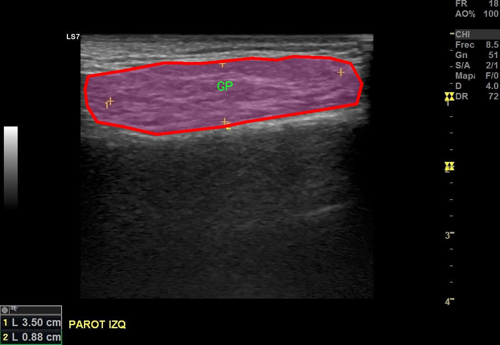
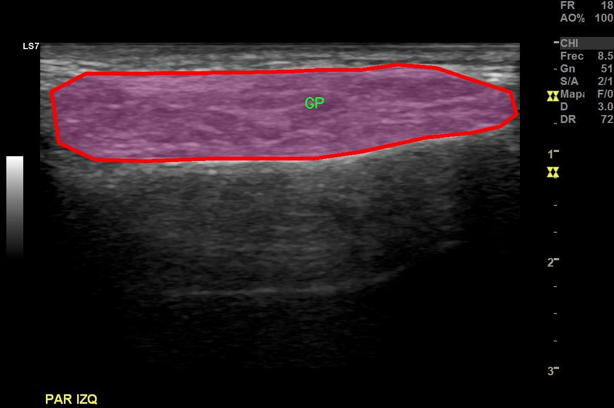

# 腺体超声图像分割系统源码＆数据集分享
 [yolov8-seg-C2f-DCNV2-Dynamic＆yolov8-seg-C2f-DiverseBranchBlock等50+全套改进创新点发刊_一键训练教程_Web前端展示]

### 1.研究背景与意义

项目参考[ILSVRC ImageNet Large Scale Visual Recognition Challenge](https://gitee.com/YOLOv8_YOLOv11_Segmentation_Studio/projects)

项目来源[AAAI Global Al lnnovation Contest](https://kdocs.cn/l/cszuIiCKVNis)

研究背景与意义

随着医学影像技术的迅速发展，超声图像在临床诊断中的应用日益广泛，尤其是在腺体疾病的检测与诊断中，超声图像因其无创、实时、便携等优点，成为了重要的辅助工具。然而，腺体超声图像的解读依赖于医生的经验，受主观因素影响较大，且腺体结构复杂，病变区域的边界模糊，给临床诊断带来了挑战。因此，开发一种高效、准确的腺体超声图像分割系统，能够显著提高诊断的准确性和效率，具有重要的临床意义。

近年来，深度学习技术在图像处理领域取得了显著进展，尤其是目标检测与分割任务中，YOLO（You Only Look Once）系列模型因其快速和高效的特性而受到广泛关注。YOLOv8作为该系列的最新版本，结合了更为先进的网络结构和训练策略，能够在保持高精度的同时实现实时处理。然而，针对腺体超声图像的特定特征，YOLOv8仍存在一定的局限性，如对小目标的检测能力不足、背景噪声对分割结果的影响等。因此，基于YOLOv8的改进，设计一个专门针对腺体超声图像的分割系统，将为医学影像分析提供新的解决方案。

本研究所使用的数据集“Clasificacion imagenes sjogren”包含1400幅腺体超声图像，涵盖了7个类别，包括GP（腺体）、GS（腺体）、Q（腺体）、V（腺体）、Vaso（血管）、gs（腺体）、v（腺体）。这些图像不仅数量丰富，而且类别多样，能够为模型的训练提供良好的基础。通过对这些图像进行实例分割，可以实现对不同腺体及其病变区域的精确识别，为后续的定量分析和临床决策提供支持。

本研究的意义在于，通过改进YOLOv8模型，提升腺体超声图像的分割精度，进而为临床医生提供更为可靠的辅助诊断工具。通过引入先进的深度学习技术，能够有效降低医生在图像解读过程中的主观偏差，提高诊断的一致性。此外，腺体超声图像的自动化分割系统还将大幅减少医生的工作负担，使其能够将更多精力投入到患者的综合治疗中。

综上所述，基于改进YOLOv8的腺体超声图像分割系统的研究，不仅具有重要的理论价值，也具备广泛的临床应用前景。通过该系统的开发与应用，能够推动腺体疾病的早期诊断与治疗，为提高患者的生活质量做出贡献。

### 2.图片演示







##### 注意：由于此博客编辑较早，上面“2.图片演示”和“3.视频演示”展示的系统图片或者视频可能为老版本，新版本在老版本的基础上升级如下：（实际效果以升级的新版本为准）

  （1）适配了YOLOV8的“目标检测”模型和“实例分割”模型，通过加载相应的权重（.pt）文件即可自适应加载模型。

  （2）支持“图片识别”、“视频识别”、“摄像头实时识别”三种识别模式。

  （3）支持“图片识别”、“视频识别”、“摄像头实时识别”三种识别结果保存导出，解决手动导出（容易卡顿出现爆内存）存在的问题，识别完自动保存结果并导出到tempDir中。

  （4）支持Web前端系统中的标题、背景图等自定义修改，后面提供修改教程。

  另外本项目提供训练的数据集和训练教程,暂不提供权重文件（best.pt）,需要您按照教程进行训练后实现图片演示和Web前端界面演示的效果。

### 3.视频演示

[3.1 视频演示](https://www.bilibili.com/video/BV18imBYSEJW/)

### 4.数据集信息展示

##### 4.1 本项目数据集详细数据（类别数＆类别名）

nc: 7
names: ['GP', 'GS', 'Q', 'V', 'Vaso', 'gs', 'v']


##### 4.2 本项目数据集信息介绍

数据集信息展示

在本研究中，我们采用了名为“Clasificacion imagenes sjogren”的数据集，以训练和改进YOLOv8-seg模型，旨在实现腺体超声图像的高效分割。该数据集包含了丰富的腺体超声图像样本，涵盖了多种不同的类别，为模型的训练提供了坚实的基础。数据集的类别数量为七个，具体类别包括：GP（腺体），GS（腺体肿块），Q（腺体液体），V（腺体血管），Vaso（血管），gs（腺体小病变），以及v（腺体大病变）。这些类别的细致划分，使得模型能够在多样化的腺体超声图像中进行精确的分割和识别。

在数据集的构建过程中，研究者们对每一类图像进行了严格的标注，确保了数据的高质量和准确性。每一张图像都经过专业的医学影像学专家审核，确保其在腺体超声图像中的代表性和典型性。这种高标准的标注过程不仅提高了数据集的可靠性，也为后续的模型训练提供了有力的支持。通过对不同类别的腺体超声图像进行标注，研究者们能够为YOLOv8-seg模型提供丰富的训练样本，使其在面对复杂的腺体结构时，能够有效地进行特征提取和分割。

此外，数据集的多样性也为模型的泛化能力提供了保障。不同类别的图像涵盖了多种腺体的不同状态和形态，包括正常的腺体结构以及各种病变的表现。这种多样性使得模型在训练过程中能够学习到更为全面的特征，从而在实际应用中具备更强的适应性和准确性。尤其是在医学影像分析领域，模型的泛化能力直接影响到其在临床实践中的应用效果。因此，数据集的构建和选择对于本研究的成功至关重要。

在数据预处理阶段，我们对“Clasificacion imagenes sjogren”数据集进行了必要的图像增强和归一化处理，以提高模型的训练效率和准确性。通过数据增强技术，我们增加了图像的多样性，包括旋转、缩放、翻转等操作，使得模型能够在更为复杂的场景中进行训练。这一过程不仅丰富了训练样本的多样性，也提高了模型对不同条件下腺体超声图像的鲁棒性。

综上所述，“Clasificacion imagenes sjogren”数据集为本研究提供了一个强有力的基础，使得我们能够在YOLOv8-seg模型的训练中实现高效的腺体超声图像分割。通过对数据集的深入分析和处理，我们期望能够显著提升模型在腺体超声图像分析中的表现，为临床医学提供更为精准的辅助诊断工具。这一研究不仅为腺体超声图像的处理提供了新的思路，也为相关领域的研究者提供了宝贵的数据资源和参考。











### 5.全套项目环境部署视频教程（零基础手把手教学）

[5.1 环境部署教程链接（零基础手把手教学）](https://www.bilibili.com/video/BV1jG4Ve4E9t/?vd_source=bc9aec86d164b67a7004b996143742dc)


[5.2 安装Python虚拟环境创建和依赖库安装视频教程链接（零基础手把手教学）](https://www.bilibili.com/video/BV1nA4VeYEze/?vd_source=bc9aec86d164b67a7004b996143742dc)

### 6.手把手YOLOV8-seg训练视频教程（零基础小白有手就能学会）

[6.1 手把手YOLOV8-seg训练视频教程（零基础小白有手就能学会）](https://www.bilibili.com/video/BV1cA4VeYETe/?vd_source=bc9aec86d164b67a7004b996143742dc)


按照上面的训练视频教程链接加载项目提供的数据集，运行train.py即可开始训练



     Epoch   gpu_mem       box       obj       cls    labels  img_size
     1/200     0G   0.01576   0.01955  0.007536        22      1280: 100%|██████████| 849/849 [14:42<00:00,  1.04s/it]
               Class     Images     Labels          P          R     mAP@.5 mAP@.5:.95: 100%|██████████| 213/213 [01:14<00:00,  2.87it/s]
                 all       3395      17314      0.994      0.957      0.0957      0.0843

     Epoch   gpu_mem       box       obj       cls    labels  img_size
     2/200     0G   0.01578   0.01923  0.007006        22      1280: 100%|██████████| 849/849 [14:44<00:00,  1.04s/it]
               Class     Images     Labels          P          R     mAP@.5 mAP@.5:.95: 100%|██████████| 213/213 [01:12<00:00,  2.95it/s]
                 all       3395      17314      0.996      0.956      0.0957      0.0845

     Epoch   gpu_mem       box       obj       cls    labels  img_size
     3/200     0G   0.01561    0.0191  0.006895        27      1280: 100%|██████████| 849/849 [10:56<00:00,  1.29it/s]
               Class     Images     Labels          P          R     mAP@.5 mAP@.5:.95: 100%|███████   | 187/213 [00:52<00:00,  4.04it/s]
                 all       3395      17314      0.996      0.957      0.0957      0.0845


### 7.50+种全套YOLOV8-seg创新点代码加载调参视频教程（一键加载写好的改进模型的配置文件）

[7.1 50+种全套YOLOV8-seg创新点代码加载调参视频教程（一键加载写好的改进模型的配置文件）](https://www.bilibili.com/video/BV1Hw4VePEXv/?vd_source=bc9aec86d164b67a7004b996143742dc)

### 8.YOLOV8-seg图像分割算法原理

原始YOLOv8-seg算法原理

YOLOv8-seg算法是基于YOLOv8模型的一个重要扩展，旨在实现高效的图像分割任务。自2015年YOLO模型首次提出以来，YOLO系列算法经历了多个版本的迭代与改进，其中YOLOv8作为最新的版本，融合了多项前沿技术，显著提升了推理速度和检测精度，成为当前目标检测和图像分割领域的热门选择。YOLOv8-seg不仅继承了YOLOv8的优良特性，还针对图像分割的需求进行了专门的优化。

YOLOv8-seg的网络结构同样由Backbone、Neck和Head三部分组成。Backbone部分负责特征提取，Neck部分用于特征融合，而Head部分则是最终输出检测结果的关键所在。YOLOv8-seg在Backbone中采用了C2f模块，这一模块通过引入更多的跳层连接，能够有效增强梯度流的信息传递，从而提升特征提取的能力。与YOLOv5的C3模块相比，C2f模块在保持轻量化的同时，提供了更丰富的特征信息，使得模型在面对复杂场景时，能够更好地捕捉到目标的细节。

在Neck部分，YOLOv8-seg同样将C3模块替换为C2f模块，并去除了不必要的卷积连接层，直接进行特征的上采样操作。这一改进不仅简化了网络结构，还提高了特征融合的效率，使得模型在处理不同尺度的目标时，能够更加灵活地调整特征图的尺寸，确保在分割任务中获取到更多的上下文信息。

YOLOv8-seg的Head部分是其创新的核心所在。与传统的Coupled-Head结构不同，YOLOv8-seg采用了Decoupled-Head结构，将目标分类和边界框回归任务解耦。这一设计使得模型在进行分类和定位时，能够分别优化各自的损失函数，从而提高了模型的收敛速度和预测精度。具体而言，YOLOv8-seg在分类分支中使用了二值交叉熵损失（BCELoss），而在边界框回归分支中则采用了分布焦点损失（DFL）和CIoU损失的组合。这种损失函数的设计旨在使模型能够更快地聚焦于目标的真实位置，进而提高分割的准确性。

值得一提的是，YOLOv8-seg在目标检测的过程中，抛弃了传统的Anchor-Based方法，转而采用Anchor-Free的策略。这一转变使得模型不再依赖于预设的锚框，而是将目标检测问题转化为关键点检测问题。通过这种方式，YOLOv8-seg能够更灵活地适应不同尺寸和形状的目标，避免了在锚框选择上的局限性。这一创新不仅简化了模型的设计，还提升了其在复杂场景下的泛化能力。

在数据增强方面，YOLOv8-seg在训练过程中引入了Mosaic数据增强技术。该技术通过将多张图像拼接成一张新图像，迫使模型学习到更多的空间信息和上下文关系，从而提升了模型的鲁棒性和泛化能力。然而，YOLOv8-seg在训练的最后阶段会停止使用Mosaic增强，以避免对模型学习真实数据分布的干扰。这一策略有效地平衡了数据增强带来的好处与潜在的负面影响，使得模型在训练后期能够更加专注于真实数据的特征学习。

YOLOv8-seg在实际应用中展现出了优越的性能，尤其是在实时性和准确性方面的兼顾，使其成为了垃圾目标检测、医学图像分析等领域的理想选择。通过在COCO数据集上的测试，YOLOv8-seg展示了其在多种尺寸下的良好精度和推理速度，证明了其在复杂场景下的有效性和实用性。

总的来说，YOLOv8-seg算法通过一系列创新的设计和优化，成功地将目标检测与图像分割任务结合在一起，展现了强大的应用潜力。其在Backbone、Neck和Head部分的改进，不仅提升了特征提取和融合的效率，还通过解耦结构和Anchor-Free策略，增强了模型的灵活性和泛化能力。随着YOLOv8-seg的不断发展和完善，未来在更多领域的应用将会更加广泛，推动计算机视觉技术的进一步进步。


### 9.系统功能展示（检测对象为举例，实际内容以本项目数据集为准）

图9.1.系统支持检测结果表格显示

  图9.2.系统支持置信度和IOU阈值手动调节

  图9.3.系统支持自定义加载权重文件best.pt(需要你通过步骤5中训练获得)

  图9.4.系统支持摄像头实时识别

  图9.5.系统支持图片识别

  图9.6.系统支持视频识别

  图9.7.系统支持识别结果文件自动保存

  图9.8.系统支持Excel导出检测结果数据


### 10.50+种全套YOLOV8-seg创新点原理讲解（非科班也可以轻松写刊发刊，V11版本正在科研待更新）

#### 10.1 由于篇幅限制，每个创新点的具体原理讲解就不一一展开，具体见下列网址中的创新点对应子项目的技术原理博客网址【Blog】：


[10.1 50+种全套YOLOV8-seg创新点原理讲解链接](https://gitee.com/qunmasj/good)

#### 10.2 部分改进模块原理讲解(完整的改进原理见上图和技术博客链接)【如果此小节的图加载失败可以通过CSDN或者Github搜索该博客的标题访问原始博客，原始博客图片显示正常】
### YOLOv8模型原理

YOLOv8是YOLO系列最新的模型,具有非常优秀的检测精度和速度。根据网络的深度与特征图的宽度大小, YOLOv8算法分为:YOLOv8-n、YOLOv8一s 、YOLOv8-m 、 YOLOv8-l、和 YOLOv8-x 5个版本。按照网络结构图,YOLOv8可分为: Inpul 、 Backbone , Neck和Head 4部分。


Backbone采用了CSPDarknet 架构，由CBS (标准卷积层)、C2f模块和 SPPF(金字塔池化）组成。通过5次标准卷积层和C2f模块逐步提取图像特征，并在网络末尾添加SPPF模块，将任意大小的输入图像转换成固定大小的特征向量。分别取P3、P4、P5层的特征提取结果，向Head输出80×80、40 × 40、20×20三个尺度的特征层。
C2f模块借鉴了残差网络(ResNet)以及ELAN的思想，其结构分为两个分支，主干部分利用Bottleneckm2%模块逐步加深网络，分支部分保留输入层通道并与主干部分特征进行融合，如图所示。通过标准卷积层提取新的特征层，相比于YOLOv5使用的C3模块，C2f模块可以在卷积层和全连接层之间建立一个平滑的转换，从而实现了参数的共享，提高了模型的效率和泛化能力。
Head采用了PAN-FPN 结构,将 Backbone输入的3个特征层进行多尺度融合，进行自顶向下(FAN)和自底向上 (PAN)的特征传递，对金字塔进行增强，使不同尺寸的特征图都包含强目标语义信息和强目标特征信息，保证了对不同尺寸样本的准确预测。
Detect借鉴了Decoupled-Head 思想，用一个解耦检测头将输入的不同尺寸特征层分成2个分支进行检测。第1个分支在进行3次卷积后使进行回归任务，输出预测框。第2个分支在进行3次卷积后进行分类任务，输出类别的概率。采用Varifocal_Loss2”作为损失函数，其式为:


### Context_Grided_Network(CGNet)简介
参考该博客提出的一种轻量化语义分割模型Context Grided Network(CGNet)，以满足设备的运行需要。

CGNet主要由CG块构建而成，CG块可以学习局部特征和周围环境上下文的联合特征，最后通过引入全局上下文特征进一步改善联合特征的学习。


 
下图给出了在Cityscapes数据集上对现有的一些语义分割模型的测试效果，横轴表示参数量，纵轴表示准确率(mIoU)。可以看出，在参数量较少的情况下，CGNet可以达到一个比较好的准确率。虽与高精度模型相去甚远，但在一些对精度要求不高、对实时性要求比较苛刻的情况下，很有价值。


高精度模型，如DeepLab、DFN、DenseASPP等，动不动就是几十M的参数，很难应用在移动设备上。而上图中红色的模型，相对内存占用较小，但它们的分割精度却不是很高。作者认为主要原因是，这些小网络大多遵循着分类网络的设计思路，并没有考虑语义分割任务更深层次的特点。

空间依赖性和上下文信息对提高分割精度有很大的作用。作者从该角度出发，提出了CG block，并进一步搭建了轻量级语义分割网络CGNet。CG块具有以下特点： 

学习局部特征和上下文特征的联合特征；
通过全局上下文特征改进上述联合特征；
可以贯穿应用在整个网络中，从low level（空间级别）到high level（语义级别）。不像PSPNet、DFN、DenseASPP等，只在编码阶段以后捕捉上下文特征。；
只有3个下采样，相比一般5个下采样的网络，能够更好地保留边缘信息。
CGNet遵循“深而薄”的原则设计，整个网络又51层构成。其中，为了降低计算，大量使用了channel-wise conv.

小型语义分割模型：

需要平衡准确率和系统开销
进化路线：ENet -> ICNet -> ESPNet
这些模型基本都基于分类网络设计，在分割准确率上效果并不是很好
上下文信息模型：

大多数现有模型只考虑解码阶段的上下文信息并且没有利用周围的上下文信息
注意力机制：

CG block使用全局上下文信息计算权重向量，并使用其细化局部特征和周围上下文特征的联合特征

#### Context Guided Block
CG block由4部分组成：


此外，CG block还采用了残差学习。文中提出了局部残差学习（LRL）和全局残差学习（GRL）两种方式。 LRL添加了从输入到联合特征提取器的连接，GRL添加了从输入到全局特征提取器的连接。从直观上来说，GRL比LRL更能促进网络中的信息传递（更像ResNet~~），后面实验部分也进行了测试，的确GRL更能提升分割精度。


CGNet的通用网络结构如下图所示，分为3个stage，第一个stage使用3个卷积层抽取特征，第二和第三个stage堆叠一定数量的CG block，具体个数可以根据情况调整。最后，通过1x1 conv得到分割结果。


下图是用于Cityscapes数据集的CGNet网络细节说明：输入尺寸为3*680*680；stage1连续使用了3个Conv-BN-PReLU组合，首个组合使用了stride=2的卷积，所以得到了1/2分辨率的feature map；stage2和stage3分别使用了多个CG block，且其中使用了不同大小的膨胀卷积核，最终分别得到了1/4和1/8的feature map。

需注意：

stage2&3的输入特征分别由其上一个stage的首个和最后一个block组合给出（参考上图的绿色箭头）；

输入注入机制，图中未体现，实际使用中，作者还将输入图像下采样1/4或1/8，分别给到stage2和stage3的输入中 ，以进一步加强特征传递。

channel-wise conv。为了缩减参数数量，在局部特征提取器和周围上下文特征提取器中使用了channel-wise卷积，可以消除跨通道的计算成本，同时节省内存占用。但是，没有像MobileNet等模型一样，在depth-wise卷积后面接point-wise卷积（1*1 conv），作者解释是，因为CG block需要保持局部特征和周围上下文特征的独立性，而1*1 conv会破坏这种独立性，所以效果欠佳，实验部分也进行了验证。

个人感觉此处应该指的是depth-wise卷积？

官方Git中对该部分的实现如下：


### 11.项目核心源码讲解（再也不用担心看不懂代码逻辑）

#### 11.1 ultralytics\utils\__init__.py

以下是经过简化和注释的核心代码部分，保留了最重要的功能和结构。

```python
# 导入必要的库
import os
import platform
import logging
from pathlib import Path
import yaml
import torch

# 设置常量
ROOT = Path(__file__).resolve().parents[1]  # 获取项目根目录
DEFAULT_CFG_PATH = ROOT / 'cfg/default.yaml'  # 默认配置文件路径

# 设置日志
def set_logging(name='ultralytics', verbose=True):
    """设置日志记录配置"""
    level = logging.INFO if verbose else logging.ERROR  # 根据是否详细设置日志级别
    logging.basicConfig(level=level, format='%(message)s')  # 配置日志格式

# 加载YAML配置文件
def yaml_load(file='data.yaml'):
    """从YAML文件加载数据"""
    with open(file, 'r', encoding='utf-8') as f:
        return yaml.safe_load(f)  # 使用安全加载，避免执行任意代码

# 保存YAML数据到文件
def yaml_save(file='data.yaml', data=None):
    """将数据保存为YAML格式"""
    with open(file, 'w', encoding='utf-8') as f:
        yaml.safe_dump(data, f, sort_keys=False)  # 保存数据，保持键的顺序

# 检查是否在Ubuntu系统上
def is_ubuntu() -> bool:
    """检查当前操作系统是否为Ubuntu"""
    return platform.system() == 'Linux' and os.path.exists('/etc/os-release')

# 获取用户配置目录
def get_user_config_dir(sub_dir='Ultralytics'):
    """获取用户配置目录"""
    if platform.system() == 'Windows':
        path = Path.home() / 'AppData' / 'Roaming' / sub_dir
    elif platform.system() == 'Darwin':  # macOS
        path = Path.home() / 'Library' / 'Application Support' / sub_dir
    else:  # Linux
        path = Path.home() / '.config' / sub_dir

    path.mkdir(parents=True, exist_ok=True)  # 创建目录
    return path

# 初始化设置管理器
class SettingsManager(dict):
    """管理Ultralytics设置的类"""
    def __init__(self, file=DEFAULT_CFG_PATH):
        """初始化设置管理器"""
        self.file = Path(file)
        if not self.file.exists():
            self.save()  # 如果文件不存在，保存默认设置
        self.load()  # 加载设置

    def load(self):
        """加载设置"""
        self.update(yaml_load(self.file))  # 更新当前字典

    def save(self):
        """保存当前设置"""
        yaml_save(self.file, dict(self))  # 将字典保存为YAML文件

# 主程序
set_logging()  # 设置日志
USER_CONFIG_DIR = get_user_config_dir()  # 获取用户配置目录
SETTINGS = SettingsManager()  # 初始化设置管理器
```

### 代码说明：
1. **导入库**：导入了必要的库，如`os`、`platform`、`logging`、`yaml`和`torch`。
2. **常量设置**：定义了项目根目录和默认配置文件路径。
3. **日志设置**：`set_logging`函数用于配置日志记录的格式和级别。
4. **YAML文件处理**：`yaml_load`和`yaml_save`函数用于加载和保存YAML格式的数据。
5. **系统检查**：`is_ubuntu`函数用于检查当前操作系统是否为Ubuntu。
6. **用户配置目录**：`get_user_config_dir`函数用于获取用户配置目录，并确保该目录存在。
7. **设置管理器**：`SettingsManager`类用于管理Ultralytics的设置，包括加载和保存设置。

这个简化版本保留了代码的核心功能，并添加了详细的中文注释，便于理解和维护。

这个文件是Ultralytics YOLO（You Only Look Once）项目的一个重要模块，主要用于初始化和配置一些工具和设置。文件的开头包含了一些必要的导入，包括标准库和第三方库，如`torch`、`cv2`、`yaml`等，这些库为后续的功能提供了支持。

文件中定义了一些常量，例如多GPU训练的相关常量`RANK`和`LOCAL_RANK`，以及一些路径常量，比如`ROOT`、`ASSETS`和`DEFAULT_CFG_PATH`，这些常量帮助管理项目的目录结构和配置文件。

接下来，文件中设置了一些全局选项，包括打印选项、OpenCV的线程设置、NumExpr的最大线程数等。这些设置有助于优化程序的性能和输出格式。

文件中定义了几个类，包括`TQDM`、`SimpleClass`和`IterableSimpleNamespace`。`TQDM`类是对原有`tqdm`库的一个封装，提供了自定义的进度条显示。`SimpleClass`提供了更友好的字符串表示和错误报告功能，方便调试。`IterableSimpleNamespace`则扩展了`SimpleNamespace`，使其可以被迭代，方便与字典配合使用。

此外，文件中还定义了一些实用函数，如`yaml_save`和`yaml_load`，用于保存和加载YAML格式的数据。这些函数支持将数据以易于阅读的格式存储和读取，便于配置管理。

在功能方面，文件中还包含了一些检查系统环境的函数，例如`is_ubuntu`、`is_colab`、`is_kaggle`等，这些函数可以判断当前运行环境，以便于根据不同环境做出相应的配置或处理。

文件的最后部分包含了一些与Git相关的函数，例如获取Git目录、获取Git远程URL和当前分支等，这些功能有助于在版本控制中管理项目。

总体而言，这个文件为Ultralytics YOLO项目提供了基础的工具和配置管理功能，确保项目在不同环境下的兼容性和可用性。通过这些设置和工具，用户可以更方便地使用YOLO进行目标检测、图像分割等任务。

#### 11.2 ultralytics\hub\__init__.py

以下是代码中最核心的部分，并附上详细的中文注释：

```python
import requests  # 导入requests库，用于发送HTTP请求

from ultralytics.hub.auth import Auth  # 导入身份验证模块
from ultralytics.utils import LOGGER, SETTINGS  # 导入日志记录和设置模块

def login(api_key=''):
    """
    使用提供的API密钥登录Ultralytics HUB API。

    参数:
        api_key (str, optional): API密钥或组合API密钥和模型ID。

    示例:
        ```python
        from ultralytics import hub
        hub.login('API_KEY')
        ```
    """
    Auth(api_key, verbose=True)  # 调用Auth类进行身份验证

def logout():
    """
    从Ultralytics HUB注销，移除设置文件中的API密钥。
    要再次登录，请使用'yolo hub login'。

    示例:
        ```python
        from ultralytics import hub
        hub.logout()
        ```
    """
    SETTINGS['api_key'] = ''  # 清空API密钥
    SETTINGS.save()  # 保存设置
    LOGGER.info(f"logged out ✅. To log in again, use 'yolo hub login'.")  # 记录注销信息

def export_model(model_id='', format='torchscript'):
    """将模型导出为指定格式。"""
    # 确保指定的导出格式是支持的格式
    assert format in export_fmts_hub(), f"不支持的导出格式 '{format}'，有效格式为 {export_fmts_hub()}"
    
    # 发送POST请求以导出模型
    r = requests.post(f'{HUB_API_ROOT}/v1/models/{model_id}/export',
                      json={'format': format},
                      headers={'x-api-key': Auth().api_key})
    
    # 检查请求是否成功
    assert r.status_code == 200, f'{format} 导出失败 {r.status_code} {r.reason}'
    LOGGER.info(f'{format} 导出已开始 ✅')  # 记录导出开始的信息

def check_dataset(path='', task='detect'):
    """
    在上传之前检查HUB数据集Zip文件的错误。
    
    参数:
        path (str, optional): 数据集Zip文件的路径（内部包含data.yaml）。默认为''。
        task (str, optional): 数据集任务。选项包括'detect'、'segment'、'pose'、'classify'。默认为'detect'。

    示例:
        ```python
        from ultralytics.hub import check_dataset
        check_dataset('path/to/coco8.zip', task='detect')  # 检查检测数据集
        ```
    """
    HUBDatasetStats(path=path, task=task).get_json()  # 获取数据集统计信息并进行检查
    LOGGER.info(f'检查完成 ✅. 将此数据集上传到 {HUB_WEB_ROOT}/datasets/.')  # 记录检查完成的信息
```

### 代码核心部分说明：
1. **登录和注销功能**：`login`和`logout`函数用于管理用户的身份验证状态，确保用户可以安全地访问HUB API。
2. **模型导出功能**：`export_model`函数允许用户将训练好的模型导出为不同的格式，以便于在不同的环境中使用。
3. **数据集检查功能**：`check_dataset`函数用于在上传数据集之前进行错误检查，确保数据集的完整性和正确性。

这个程序文件是Ultralytics YOLO框架的一部分，主要用于与Ultralytics HUB进行交互。它提供了一系列函数，用于用户登录、登出、模型重置、模型导出、数据集检查等功能。

首先，文件中导入了一些必要的模块和类，包括处理HTTP请求的`requests`库，以及一些Ultralytics内部的工具和设置。这些导入的内容为后续的功能实现提供了支持。

`login`函数允许用户通过提供API密钥来登录Ultralytics HUB。用户可以传入一个API密钥，函数会创建一个`Auth`对象并进行登录。示例代码展示了如何使用该函数。

`logout`函数则用于登出操作，它会清空设置文件中的API密钥，并记录登出信息。用户在需要重新登录时，可以使用`yolo hub login`命令。

`reset_model`函数用于将训练过的模型重置为未训练状态。它通过发送POST请求到HUB API的`model-reset`端点来实现，并根据返回的状态码记录操作结果。

`export_fmts_hub`函数返回HUB支持的模型导出格式的列表。它从`ultralytics.engine.exporter`模块中获取可用的导出格式，并添加了两个特定的格式。

`export_model`函数允许用户将模型导出为指定格式。用户需要提供模型ID和导出格式，函数会检查格式的有效性，然后发送请求到HUB API进行导出，并记录导出开始的信息。

`get_export`函数用于获取已导出的模型的下载链接。它会检查导出格式的有效性，发送请求获取模型的导出信息，并返回包含下载URL的字典。

最后，`check_dataset`函数用于在上传数据集到HUB之前进行错误检查。用户可以传入数据集的路径和任务类型（如检测、分割、姿态估计等），函数会检查数据集的完整性，并在检查完成后记录信息，提示用户可以上传数据集。

总体而言，这个文件提供了一系列便捷的API接口，方便用户与Ultralytics HUB进行交互，管理模型和数据集。

#### 11.3 ultralytics\nn\backbone\lsknet.py

以下是经过简化和注释的核心代码部分：

```python
import torch
import torch.nn as nn
from functools import partial

class Mlp(nn.Module):
    """多层感知机（MLP）模块，包含卷积层和激活函数"""
    def __init__(self, in_features, hidden_features=None, out_features=None, act_layer=nn.GELU, drop=0.):
        super().__init__()
        out_features = out_features or in_features  # 输出特征数
        hidden_features = hidden_features or in_features  # 隐藏层特征数
        self.fc1 = nn.Conv2d(in_features, hidden_features, 1)  # 第一个卷积层
        self.dwconv = DWConv(hidden_features)  # 深度卷积层
        self.act = act_layer()  # 激活函数
        self.fc2 = nn.Conv2d(hidden_features, out_features, 1)  # 第二个卷积层
        self.drop = nn.Dropout(drop)  # Dropout层

    def forward(self, x):
        """前向传播"""
        x = self.fc1(x)
        x = self.dwconv(x)
        x = self.act(x)
        x = self.drop(x)
        x = self.fc2(x)
        x = self.drop(x)
        return x


class Attention(nn.Module):
    """注意力模块"""
    def __init__(self, d_model):
        super().__init__()
        self.proj_1 = nn.Conv2d(d_model, d_model, 1)  # 线性投影
        self.activation = nn.GELU()  # 激活函数
        self.spatial_gating_unit = LSKblock(d_model)  # 空间门控单元
        self.proj_2 = nn.Conv2d(d_model, d_model, 1)  # 线性投影

    def forward(self, x):
        """前向传播"""
        shortcut = x.clone()  # 残差连接
        x = self.proj_1(x)
        x = self.activation(x)
        x = self.spatial_gating_unit(x)
        x = self.proj_2(x)
        x = x + shortcut  # 残差连接
        return x


class Block(nn.Module):
    """网络中的基本块，包含注意力和MLP"""
    def __init__(self, dim, mlp_ratio=4., drop=0., drop_path=0., act_layer=nn.GELU):
        super().__init__()
        self.norm1 = nn.BatchNorm2d(dim)  # 归一化层
        self.norm2 = nn.BatchNorm2d(dim)  # 归一化层
        self.attn = Attention(dim)  # 注意力模块
        self.mlp = Mlp(in_features=dim, hidden_features=int(dim * mlp_ratio), act_layer=act_layer, drop=drop)  # MLP模块

    def forward(self, x):
        """前向传播"""
        x = x + self.attn(self.norm1(x))  # 添加注意力模块的输出
        x = x + self.mlp(self.norm2(x))  # 添加MLP模块的输出
        return x


class LSKNet(nn.Module):
    """LSKNet模型"""
    def __init__(self, img_size=224, in_chans=3, embed_dims=[64, 128, 256, 512], depths=[3, 4, 6, 3]):
        super().__init__()
        self.num_stages = len(depths)  # 网络阶段数
        for i in range(self.num_stages):
            # 每个阶段的嵌入层和块
            patch_embed = OverlapPatchEmbed(img_size=img_size // (2 ** i), in_chans=in_chans if i == 0 else embed_dims[i - 1], embed_dim=embed_dims[i])
            block = nn.ModuleList([Block(dim=embed_dims[i]) for _ in range(depths[i])])
            setattr(self, f"patch_embed{i + 1}", patch_embed)
            setattr(self, f"block{i + 1}", block)

    def forward(self, x):
        """前向传播"""
        outs = []
        for i in range(self.num_stages):
            patch_embed = getattr(self, f"patch_embed{i + 1}")
            block = getattr(self, f"block{i + 1}")
            x, _, _ = patch_embed(x)  # 嵌入层
            for blk in block:
                x = blk(x)  # 通过块
            outs.append(x)  # 保存输出
        return outs


class DWConv(nn.Module):
    """深度卷积模块"""
    def __init__(self, dim=768):
        super(DWConv, self).__init__()
        self.dwconv = nn.Conv2d(dim, dim, 3, 1, 1, bias=True, groups=dim)  # 深度卷积

    def forward(self, x):
        """前向传播"""
        return self.dwconv(x)


def lsknet_t():
    """构建LSKNet-t模型"""
    return LSKNet(embed_dims=[32, 64, 160, 256], depths=[3, 3, 5, 2])

def lsknet_s():
    """构建LSKNet-s模型"""
    return LSKNet(embed_dims=[64, 128, 256, 512], depths=[2, 2, 4, 2])
```

### 代码说明：
1. **Mlp类**：实现了一个多层感知机，包含两个卷积层和一个深度卷积层，用于特征变换。
2. **Attention类**：实现了一个注意力机制，包含线性投影和空间门控单元。
3. **Block类**：网络的基本构建块，包含注意力模块和MLP模块，支持残差连接。
4. **LSKNet类**：整个网络结构，包含多个阶段，每个阶段由嵌入层和多个Block组成。
5. **DWConv类**：实现了深度卷积，用于特征提取。
6. **lsknet_t和lsknet_s函数**：分别构建不同配置的LSKNet模型。

这个程序文件定义了一个名为 LSKNet 的神经网络模型，主要用于图像处理任务。该模型包含多个模块和层，使用了深度学习中的一些常见技术，如卷积、注意力机制和多层感知机（MLP）。以下是对代码的详细说明。

首先，导入了必要的库，包括 PyTorch 和一些辅助函数。`Mlp` 类定义了一个多层感知机结构，它包含两个卷积层和一个深度卷积层（DWConv），以及激活函数和 dropout 层。这个模块的作用是对输入特征进行非线性变换和降维。

接下来，`LSKblock` 类实现了一个特定的块结构，其中使用了深度可分离卷积和空间注意力机制。这个块通过对输入进行多种卷积操作，提取特征并生成注意力权重，最后将输入与加权后的特征相乘，从而增强重要特征。

`Attention` 类则实现了一个简单的注意力机制，它通过两个卷积层和一个 LSKblock 来处理输入特征，最终将处理后的特征与原始输入相加，以保留原始信息。

`Block` 类是 LSKNet 的基本构建块，包含了归一化层、注意力层和 MLP。它使用了残差连接和随机深度（DropPath）技术，以提高模型的训练效果和稳定性。

`OverlapPatchEmbed` 类负责将输入图像分割成重叠的补丁，并进行嵌入。它使用卷积层将输入通道数转换为嵌入维度，并对嵌入结果进行归一化处理。

`LSKNet` 类是整个网络的核心，它由多个阶段组成，每个阶段包含补丁嵌入、多个块和归一化层。通过循环处理输入，逐步提取特征并进行变换，最终输出多个阶段的特征图。

`DWConv` 类实现了深度卷积操作，用于特征提取。

`update_weight` 函数用于更新模型的权重，确保加载的权重与模型的结构匹配。

`lsknet_t` 和 `lsknet_s` 函数分别定义了两种不同配置的 LSKNet 模型，允许用户选择不同的嵌入维度和深度，并可选择加载预训练权重。

最后，在 `__main__` 部分，创建了一个 LSKNet 模型实例，并使用随机输入进行测试，打印输出特征图的尺寸。

整体来看，这个文件实现了一个灵活且高效的神经网络架构，适用于各种图像处理任务，尤其是在需要提取复杂特征的场景中。

#### 11.4 ultralytics\utils\callbacks\tensorboard.py

以下是经过简化和注释的核心代码部分，主要关注于TensorBoard的初始化和日志记录功能：

```python
# 导入必要的库
from ultralytics.utils import LOGGER, SETTINGS, TESTS_RUNNING, colorstr

try:
    # 尝试导入TensorBoard的SummaryWriter
    from torch.utils.tensorboard import SummaryWriter

    # 确保当前不是在测试运行中
    assert not TESTS_RUNNING  
    # 确保TensorBoard集成已启用
    assert SETTINGS['tensorboard'] is True  
    WRITER = None  # 初始化TensorBoard的SummaryWriter实例

except (ImportError, AssertionError, TypeError):
    # 处理导入错误或断言错误
    SummaryWriter = None  # 如果导入失败，则将SummaryWriter设置为None


def _log_scalars(scalars, step=0):
    """将标量值记录到TensorBoard中。"""
    if WRITER:  # 如果WRITER已初始化
        for k, v in scalars.items():  # 遍历标量字典
            WRITER.add_scalar(k, v, step)  # 记录每个标量


def on_pretrain_routine_start(trainer):
    """在预训练例程开始时初始化TensorBoard日志记录。"""
    if SummaryWriter:  # 如果SummaryWriter可用
        try:
            global WRITER  # 声明全局变量WRITER
            WRITER = SummaryWriter(str(trainer.save_dir))  # 创建SummaryWriter实例
            prefix = colorstr('TensorBoard: ')
            # 日志输出TensorBoard启动信息
            LOGGER.info(f"{prefix}Start with 'tensorboard --logdir {trainer.save_dir}', view at http://localhost:6006/")
        except Exception as e:
            # 如果初始化失败，记录警告信息
            LOGGER.warning(f'WARNING ⚠️ TensorBoard not initialized correctly, not logging this run. {e}')


def on_batch_end(trainer):
    """在训练批次结束时记录标量统计信息。"""
    _log_scalars(trainer.label_loss_items(trainer.tloss, prefix='train'), trainer.epoch + 1)  # 记录训练损失


def on_fit_epoch_end(trainer):
    """在训练周期结束时记录周期指标。"""
    _log_scalars(trainer.metrics, trainer.epoch + 1)  # 记录训练指标


# 定义回调函数字典，如果SummaryWriter可用则包含相关函数
callbacks = {
    'on_pretrain_routine_start': on_pretrain_routine_start,
    'on_fit_epoch_end': on_fit_epoch_end,
    'on_batch_end': on_batch_end
} if SummaryWriter else {}
```

### 代码注释说明：
1. **导入部分**：导入必要的模块和工具，特别是TensorBoard的`SummaryWriter`用于记录训练过程中的数据。
2. **异常处理**：在导入`SummaryWriter`时进行异常处理，以确保在导入失败时不会导致程序崩溃。
3. **日志记录函数**：`_log_scalars`函数用于将标量数据记录到TensorBoard中。
4. **回调函数**：定义了一些回调函数，用于在训练过程的不同阶段记录数据，例如在预训练开始时初始化TensorBoard，训练批次结束时记录损失，以及训练周期结束时记录指标。
5. **回调字典**：根据`SummaryWriter`的可用性构建回调函数字典，以便在训练过程中自动调用相应的记录函数。

这个程序文件是一个用于集成 TensorBoard 的回调函数模块，主要用于在训练过程中记录和可视化模型的训练过程。文件的开头部分导入了一些必要的库和模块，包括日志记录器、设置和 TensorBoard 的 SummaryWriter。它首先尝试导入 `torch.utils.tensorboard` 中的 `SummaryWriter`，并进行了一些基本的检查，比如确保当前不是在运行测试，并且设置中启用了 TensorBoard。如果导入失败或检查不通过，则将 `SummaryWriter` 设置为 `None`。

接下来，定义了几个函数。`_log_scalars` 函数用于将标量值记录到 TensorBoard，接受一个字典形式的标量和步数作为参数。如果 `WRITER` 实例存在，它会遍历标量字典并将每个标量添加到 TensorBoard 中。

`_log_tensorboard_graph` 函数用于将模型的计算图记录到 TensorBoard。它首先获取输入图像的大小，并创建一个全零的张量作为输入。然后使用 `torch.jit.trace` 来追踪模型，并将图形添加到 TensorBoard 中。如果在此过程中发生异常，会记录一个警告信息。

`on_pretrain_routine_start` 函数在训练前的例程开始时被调用，用于初始化 TensorBoard 的日志记录。如果 `SummaryWriter` 存在，它会创建一个新的 `SummaryWriter` 实例，并输出一个信息，提示用户如何启动 TensorBoard 以查看日志。

`on_train_start` 函数在训练开始时被调用，主要用于记录模型的计算图。

`on_batch_end` 函数在每个训练批次结束时被调用，记录当前批次的标量统计信息。

`on_fit_epoch_end` 函数在每个训练周期结束时被调用，记录该周期的指标。

最后，定义了一个 `callbacks` 字典，包含了前面定义的回调函数，只有在 `SummaryWriter` 存在的情况下才会被填充。这使得在训练过程中可以根据不同的事件调用相应的回调函数，以实现对训练过程的监控和可视化。

#### 11.5 ultralytics\nn\modules\conv.py

以下是代码中最核心的部分，并附上详细的中文注释：

```python
import torch
import torch.nn as nn

def autopad(k, p=None, d=1):  # kernel, padding, dilation
    """自动填充以确保输出形状与输入形状相同。"""
    if d > 1:
        # 计算实际的卷积核大小
        k = d * (k - 1) + 1 if isinstance(k, int) else [d * (x - 1) + 1 for x in k]
    if p is None:
        # 默认填充为卷积核大小的一半
        p = k // 2 if isinstance(k, int) else [x // 2 for x in k]
    return p

class Conv(nn.Module):
    """标准卷积层，包含卷积、批归一化和激活函数。"""
    default_act = nn.SiLU()  # 默认激活函数

    def __init__(self, c1, c2, k=1, s=1, p=None, g=1, d=1, act=True):
        """初始化卷积层，参数包括输入通道数、输出通道数、卷积核大小、步幅、填充、分组、扩张和激活函数。"""
        super().__init__()
        self.conv = nn.Conv2d(c1, c2, k, s, autopad(k, p, d), groups=g, dilation=d, bias=False)  # 卷积层
        self.bn = nn.BatchNorm2d(c2)  # 批归一化层
        # 根据参数选择激活函数
        self.act = self.default_act if act is True else act if isinstance(act, nn.Module) else nn.Identity()

    def forward(self, x):
        """前向传播，依次经过卷积、批归一化和激活函数。"""
        return self.act(self.bn(self.conv(x)))

class DWConv(Conv):
    """深度卷积层，适用于每个输入通道单独进行卷积。"""

    def __init__(self, c1, c2, k=1, s=1, d=1, act=True):
        """初始化深度卷积层，参数包括输入通道数、输出通道数、卷积核大小、步幅、扩张和激活函数。"""
        super().__init__(c1, c2, k, s, g=math.gcd(c1, c2), d=d, act=act)

class ConvTranspose(nn.Module):
    """转置卷积层，用于上采样。"""
    default_act = nn.SiLU()  # 默认激活函数

    def __init__(self, c1, c2, k=2, s=2, p=0, bn=True, act=True):
        """初始化转置卷积层，参数包括输入通道数、输出通道数、卷积核大小、步幅、填充、是否使用批归一化和激活函数。"""
        super().__init__()
        self.conv_transpose = nn.ConvTranspose2d(c1, c2, k, s, p, bias=not bn)  # 转置卷积层
        self.bn = nn.BatchNorm2d(c2) if bn else nn.Identity()  # 批归一化层
        self.act = self.default_act if act is True else act if isinstance(act, nn.Module) else nn.Identity()

    def forward(self, x):
        """前向传播，依次经过转置卷积、批归一化和激活函数。"""
        return self.act(self.bn(self.conv_transpose(x)))

class ChannelAttention(nn.Module):
    """通道注意力模块，用于增强特征通道的重要性。"""

    def __init__(self, channels: int) -> None:
        """初始化通道注意力模块，参数为通道数。"""
        super().__init__()
        self.pool = nn.AdaptiveAvgPool2d(1)  # 自适应平均池化
        self.fc = nn.Conv2d(channels, channels, 1, 1, 0, bias=True)  # 1x1卷积
        self.act = nn.Sigmoid()  # 激活函数

    def forward(self, x: torch.Tensor) -> torch.Tensor:
        """前向传播，计算通道注意力并加权输入特征。"""
        return x * self.act(self.fc(self.pool(x)))

class SpatialAttention(nn.Module):
    """空间注意力模块，用于增强特征图的空间信息。"""

    def __init__(self, kernel_size=7):
        """初始化空间注意力模块，参数为卷积核大小。"""
        super().__init__()
        assert kernel_size in (3, 7), '卷积核大小必须为3或7'
        padding = 3 if kernel_size == 7 else 1
        self.cv1 = nn.Conv2d(2, 1, kernel_size, padding=padding, bias=False)  # 卷积层
        self.act = nn.Sigmoid()  # 激活函数

    def forward(self, x):
        """前向传播，计算空间注意力并加权输入特征。"""
        return x * self.act(self.cv1(torch.cat([torch.mean(x, 1, keepdim=True), torch.max(x, 1, keepdim=True)[0]], 1)))

class CBAM(nn.Module):
    """卷积块注意力模块，结合通道和空间注意力。"""

    def __init__(self, c1, kernel_size=7):
        """初始化CBAM模块，参数为输入通道数和卷积核大小。"""
        super().__init__()
        self.channel_attention = ChannelAttention(c1)  # 通道注意力
        self.spatial_attention = SpatialAttention(kernel_size)  # 空间注意力

    def forward(self, x):
        """前向传播，依次经过通道注意力和空间注意力。"""
        return self.spatial_attention(self.channel_attention(x))
```

### 代码核心部分说明：
1. **自动填充函数 `autopad`**：确保卷积操作后输出的形状与输入相同。
2. **卷积层 `Conv`**：实现标准卷积操作，包含批归一化和激活函数。
3. **深度卷积 `DWConv`**：实现深度卷积，适用于每个输入通道单独进行卷积。
4. **转置卷积 `ConvTranspose`**：用于上采样的转置卷积层。
5. **通道注意力 `ChannelAttention`**：通过自适应平均池化和1x1卷积增强特征通道的重要性。
6. **空间注意力 `SpatialAttention`**：通过对特征图进行卷积和激活增强空间信息。
7. **CBAM模块**：结合通道和空间注意力的模块，用于提升特征图的表示能力。

这个程序文件是Ultralytics YOLO框架中的一个模块，主要实现了各种卷积操作的类和功能。代码中包含了多个卷积层的定义，旨在为深度学习模型提供灵活的卷积操作。

首先，文件导入了必要的库，包括`math`、`numpy`和`torch`，并定义了一个名为`autopad`的函数，该函数用于根据卷积核的大小、填充和扩张率自动计算填充量，以确保输出形状与输入形状相同。

接下来，定义了多个卷积相关的类。`Conv`类是标准卷积层的实现，包含卷积、批归一化和激活函数的组合。其构造函数接收多个参数，如输入通道数、输出通道数、卷积核大小、步幅、填充、分组和扩张率等。在前向传播中，输入经过卷积、批归一化和激活函数处理。

`Conv2`类是对`Conv`类的扩展，增加了一个1x1的卷积层，并在前向传播中将两个卷积的输出相加。`LightConv`类实现了一种轻量级卷积结构，包含两个卷积层的组合，旨在减少计算量。

`DWConv`类实现了深度卷积，适用于输入和输出通道数相同的情况。`DWConvTranspose2d`类是深度转置卷积的实现，允许在转置卷积中使用深度卷积的特性。

`ConvTranspose`类实现了转置卷积层，支持批归一化和激活函数。`Focus`类则通过将输入的空间信息聚合到通道维度，减少了特征图的尺寸。

`GhostConv`类实现了Ghost卷积，旨在通过少量的参数实现高效的特征提取。`RepConv`类则是一个基础的重复卷积块，支持训练和推理阶段的不同处理。

此外，文件中还实现了几种注意力机制的模块，包括`ChannelAttention`、`SpatialAttention`和`CBAM`，这些模块用于增强特征图的表达能力，通过对通道和空间信息的重标定来提高模型的性能。

最后，`Concat`类用于在指定维度上连接多个张量，方便在模型中处理不同的特征图。

总体而言，这个文件提供了多种卷积操作和注意力机制的实现，旨在为YOLO模型的构建和训练提供灵活的基础组件。

### 12.系统整体结构（节选）

### 整体功能和构架概括

Ultralytics YOLO框架是一个用于目标检测和图像处理的深度学习框架。其整体功能涵盖了模型的构建、训练、评估和可视化等多个方面。框架采用模块化设计，便于扩展和维护。各个模块之间通过清晰的接口进行交互，使得用户可以方便地进行模型的定制和优化。

- **utils**模块提供了各种工具函数和配置管理，帮助用户在不同环境下使用框架。
- **hub**模块则负责与Ultralytics HUB进行交互，支持模型和数据集的管理。
- **nn**模块包含了网络结构的定义，包括基础的卷积操作和复杂的神经网络架构，如LSKNet。
- **callbacks**模块实现了训练过程中的回调函数，支持TensorBoard的集成，便于监控训练过程。

### 文件功能整理表

| 文件路径                                    | 功能描述                                                         |
|---------------------------------------------|------------------------------------------------------------------|
| `ultralytics/utils/__init__.py`            | 提供工具函数和常量定义，管理配置和环境检查，支持模型训练的基础设置。 |
| `ultralytics/hub/__init__.py`              | 实现与Ultralytics HUB的交互，包括用户登录、模型导出和数据集检查等功能。 |
| `ultralytics/nn/backbone/lsknet.py`        | 定义LSKNet模型结构，包括多个卷积块、注意力机制和多层感知机等。       |
| `ultralytics/utils/callbacks/tensorboard.py` | 集成TensorBoard的回调函数，用于记录和可视化训练过程中的指标和模型图。 |
| `ultralytics/nn/modules/conv.py`           | 实现多种卷积操作和注意力机制的模块，提供基础的卷积层和复杂的网络结构。   |

通过这些模块的协同工作，Ultralytics YOLO框架能够为用户提供一个高效、灵活的目标检测解决方案。

注意：由于此博客编辑较早，上面“11.项目核心源码讲解（再也不用担心看不懂代码逻辑）”中部分代码可能会优化升级，仅供参考学习，完整“训练源码”、“Web前端界面”和“50+种创新点源码”以“14.完整训练+Web前端界面+50+种创新点源码、数据集获取”的内容为准。

### 13.图片、视频、摄像头图像分割Demo(去除WebUI)代码

在这个博客小节中，我们将讨论如何在不使用WebUI的情况下，实现图像分割模型的使用。本项目代码已经优化整合，方便用户将分割功能嵌入自己的项目中。
核心功能包括图片、视频、摄像头图像的分割，ROI区域的轮廓提取、类别分类、周长计算、面积计算、圆度计算以及颜色提取等。
这些功能提供了良好的二次开发基础。

### 核心代码解读

以下是主要代码片段，我们会为每一块代码进行详细的批注解释：

```python
import random
import cv2
import numpy as np
from PIL import ImageFont, ImageDraw, Image
from hashlib import md5
from model import Web_Detector
from chinese_name_list import Label_list

# 根据名称生成颜色
def generate_color_based_on_name(name):
    ......

# 计算多边形面积
def calculate_polygon_area(points):
    return cv2.contourArea(points.astype(np.float32))

...
# 绘制中文标签
def draw_with_chinese(image, text, position, font_size=20, color=(255, 0, 0)):
    image_pil = Image.fromarray(cv2.cvtColor(image, cv2.COLOR_BGR2RGB))
    draw = ImageDraw.Draw(image_pil)
    font = ImageFont.truetype("simsun.ttc", font_size, encoding="unic")
    draw.text(position, text, font=font, fill=color)
    return cv2.cvtColor(np.array(image_pil), cv2.COLOR_RGB2BGR)

# 动态调整参数
def adjust_parameter(image_size, base_size=1000):
    max_size = max(image_size)
    return max_size / base_size

# 绘制检测结果
def draw_detections(image, info, alpha=0.2):
    name, bbox, conf, cls_id, mask = info['class_name'], info['bbox'], info['score'], info['class_id'], info['mask']
    adjust_param = adjust_parameter(image.shape[:2])
    spacing = int(20 * adjust_param)

    if mask is None:
        x1, y1, x2, y2 = bbox
        aim_frame_area = (x2 - x1) * (y2 - y1)
        cv2.rectangle(image, (x1, y1), (x2, y2), color=(0, 0, 255), thickness=int(3 * adjust_param))
        image = draw_with_chinese(image, name, (x1, y1 - int(30 * adjust_param)), font_size=int(35 * adjust_param))
        y_offset = int(50 * adjust_param)  # 类别名称上方绘制，其下方留出空间
    else:
        mask_points = np.concatenate(mask)
        aim_frame_area = calculate_polygon_area(mask_points)
        mask_color = generate_color_based_on_name(name)
        try:
            overlay = image.copy()
            cv2.fillPoly(overlay, [mask_points.astype(np.int32)], mask_color)
            image = cv2.addWeighted(overlay, 0.3, image, 0.7, 0)
            cv2.drawContours(image, [mask_points.astype(np.int32)], -1, (0, 0, 255), thickness=int(8 * adjust_param))

            # 计算面积、周长、圆度
            area = cv2.contourArea(mask_points.astype(np.int32))
            perimeter = cv2.arcLength(mask_points.astype(np.int32), True)
            ......

            # 计算色彩
            mask = np.zeros(image.shape[:2], dtype=np.uint8)
            cv2.drawContours(mask, [mask_points.astype(np.int32)], -1, 255, -1)
            color_points = cv2.findNonZero(mask)
            ......

            # 绘制类别名称
            x, y = np.min(mask_points, axis=0).astype(int)
            image = draw_with_chinese(image, name, (x, y - int(30 * adjust_param)), font_size=int(35 * adjust_param))
            y_offset = int(50 * adjust_param)

            # 绘制面积、周长、圆度和色彩值
            metrics = [("Area", area), ("Perimeter", perimeter), ("Circularity", circularity), ("Color", color_str)]
            for idx, (metric_name, metric_value) in enumerate(metrics):
                ......

    return image, aim_frame_area

# 处理每帧图像
def process_frame(model, image):
    pre_img = model.preprocess(image)
    pred = model.predict(pre_img)
    det = pred[0] if det is not None and len(det)
    if det:
        det_info = model.postprocess(pred)
        for info in det_info:
            image, _ = draw_detections(image, info)
    return image

if __name__ == "__main__":
    cls_name = Label_list
    model = Web_Detector()
    model.load_model("./weights/yolov8s-seg.pt")

    # 摄像头实时处理
    cap = cv2.VideoCapture(0)
    while cap.isOpened():
        ret, frame = cap.read()
        if not ret:
            break
        ......

    # 图片处理
    image_path = './icon/OIP.jpg'
    image = cv2.imread(image_path)
    if image is not None:
        processed_image = process_frame(model, image)
        ......

    # 视频处理
    video_path = ''  # 输入视频的路径
    cap = cv2.VideoCapture(video_path)
    while cap.isOpened():
        ret, frame = cap.read()
        ......
```


### 14.完整训练+Web前端界面+50+种创新点源码、数据集获取


# [下载链接：https://mbd.pub/o/bread/Z5WalJpx](https://mbd.pub/o/bread/Z5WalJpx)